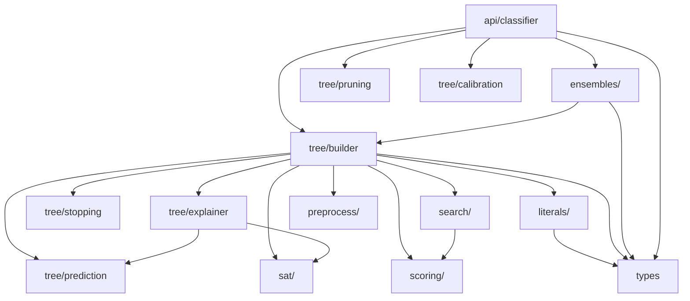

# Architecture

## Dependency Graph



**Dependency direction**: `api → ensembles → tree → {search, scoring, sat, literals, preprocess}`

**Forbidden edges** (no upward imports): `literals ← tree`, `search ← api`, `sat ← ensembles`

## Module Responsibilities

### `types.py`
Zero-dependency enumerations and configuration tables. Defines `LanguageFamily`, `LiteralPolarity`, `ClauseArity`, `CompareOp`, `GSNHPatternType`, and the valid/anti-horn config dictionaries.

### `literals/`
Data structures for the three literal types used in GSNH clauses:

- **`GSNHLiteral`** — univariate threshold: `x[f] ≥ t` or `x[f] < t`
- **`GSNHBinaryLiteral`** — binary comparison: `x[f] ≥ x[g]`
- **`CompareLiteral`** — general comparison: `x[f] ≤ x[g]`, `x[f] > x[g]`
- **`GSNHPredicate`** — a disjunctive clause of 1–3 literals with Horn/Anti-Horn validation

### `scoring/`
JIT-compiled (`@njit`) information-theoretic scoring:

- Binary Shannon entropy, information gain, gain ratio
- BIC-based penalized gain (controls model complexity)
- Fast histogram-based gain for look-ahead

### `search/`
JIT-compiled exhaustive search kernels using integral images (prefix sums):

| Module | Complexity | Family |
|--------|-----------|--------|
| `prefix.py` | O(n) build, O(1) query | foundation |
| `tensors.py` | O(n) build | foundation |
| `exhaustive_1d.py` | O(bins) | Horn / Anti-Horn |
| `exhaustive_2d.py` | O(bins²) | Horn |
| `exhaustive_3d.py` | O(bins³), parallel | Horn |
| `antihorn.py` | O(bins²), O(bins³) | Anti-Horn |
| `affine_search.py` | O(bins²), O(bins³) | Affine/XOR |

### `sat/`
Exact polynomial-time SAT solvers for tractable language families:

- **Horn-SAT**: forward chaining, O(n·m)
- **Anti-Horn-SAT**: polarity flip → Horn-SAT
- **2-SAT**: implication graph + Kosaraju's SCC, O(n+m)
- **Affine-SAT**: Gaussian elimination over GF(2), O(n³)

### `tree/`
Core tree construction and supporting components:

- **`builder.py`** — `ExpertGSNHTree`: training, split search, tree construction (~1,250 lines). Delegates prediction and explainer methods to separate modules.
- **`prediction.py`** — `predict_proba`, `predict`, `_batch_traverse`, `_traverse` (47 lines)
- **`explainer.py`** — `weak_axp_check`, `_is_sat_path`, `_path_sat_numeric`, `_solve_or_clauses_dfs`, `_affine_path_sat`, `extract_axp` (220 lines)
- **`stopping.py`** — `StoppingCriteria` dataclass with depth/purity/gain checks
- **`pruning.py`** — `CostComplexityPruner` for post-training subtree pruning
- **`calibration.py`** — `ProbabilityCalibrator` (Platt scaling / isotonic)

### `ensembles/`
Ensemble wrappers that create multiple `ExpertGSNHTree` instances:

- **`GSNHRandomForest`** — bootstrap + feature subsampling + OOB scoring
- **`GSNHGradientBoosting`** — regression stumps on pseudo-residuals, L2 reg, LR decay, early stopping

### `api/`
Top-level `GSNHClassifier` pipeline: automatic model selection (`single` / `forest` / `boosting`), optional pruning, optional probability calibration.

## JIT Compilation Strategy

All `@njit` functions are **module-level, stateless, and self-contained**. They cannot reference Python classes. This is by design:

1. Numba compiles them once per process (with `cache=True`)
2. `parallel=True` is used only for 3D search and anti-horn 3D
3. JIT functions compose via import — no class coupling

## Tree Internal Representation

Trees are nested Python dictionaries:

```python
node = {
    'predicate': GSNHPredicate,   # split condition
    'distribution': [n_neg, n_pos],  # class counts
    'n_samples': int,
    'left': node_or_None,        # predicate=True
    'right': node_or_None,       # predicate=False
    'is_leaf': bool,
    'language': str,
}
```

Traversal: `left` = predicate evaluates `True`, `right` = `False`.
